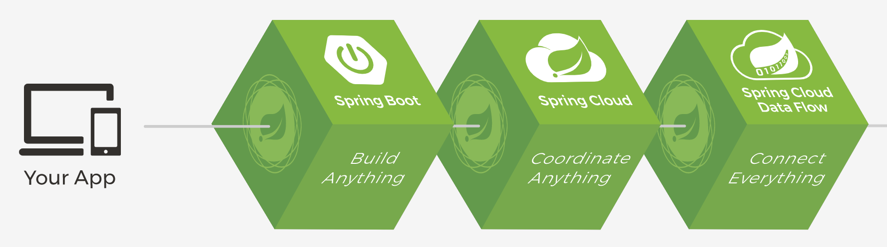

<!-- overwrite css-->

# Spring Memo
-------------
Kazuki Motohashi @ Konduit KK

--

## Agenda

- Spring Framework
- Spring Boot
- Spring Cloud
- Spring Cloud Data Flow

--

## Spring Framework

- provides patterns and structure
- handles common things that most developers need to do:
  - creates and manages singleton instances with application context
  - builds objects relation graph by dependency injection
  - provides database connectivity
  - web applications skeleton (Spring MVC)

--

--

## Spring Boot

-

--

## Spring Cloud

--

## Spring Cloud Data Flow

- management tool to define pipeline of components implemented using Spring Cloud Stream (streaming) and/or Spring Task (batch), deploy/undeploy applications, etc
- provides both CLI and GUI (based on Spring Flo)
- bash-like DSL (Domain Specific Language)

`http --port=8181 | log`

- 