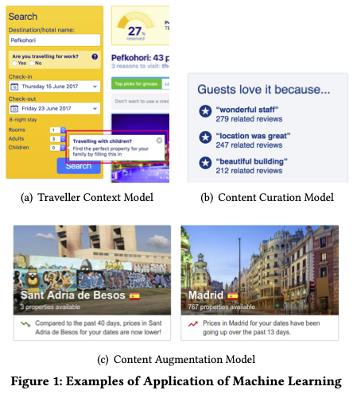

<!-- overwrite css-->

<!-- 発表時間目安30分+質問10分 -->

#### 論文解説
### 150 Successful Machine Learning Models:   6 Lessons Learned at Booking.com
---
#### Konduit株式会社　本橋 和貴

@kmotohas

実践者向けディープラーニング勉強会　第8回　2019年11月18日

--

### どんな論文か

 
 <ul>
  <li> 世界最大のオンライン旅行サイト Booking.com における約150の機械学習アプリ開発経験から学んだベストプラクティスの紹介 </li>
  <ul>
  <li> 使われているモデル </li>
  <li> モニタリング </li>
  <li> レイテンシー </li>
  <li> A/Bテスト </li>
  </ul>
 </ul>

※ [Gigazineの記事](https://gigazine.net/amp/20191009-machine-learning-booking-com)でだいたいわかる

--

### 課題

- High Stakes
- Infinitesimal Queries
- Complex Items
- Constrained Supply
- Continuous Cold Start
- Content Overload

<!-- -->

--

### Booking.comで用いられているモデル

>- 旅行者の好みを幅広く予測
>- 旅行の文脈を予測
>- 履歴などからユーザーの見た内容をトラッキング
>- UIを最適化
>- レビューを始めとするコンテンツを集めてどれを表示するか
>- 価格やオプションのトレンド

--

### 具体例

<!-- Figure 1 -->

 
 

 (a)  
 (b)  
 (c) 
 

---

### 6つのレッスン

> 1. 機械学習モデルを導入したプロジェクトは大きなビジネス価値をもたらす
> 2. 機械学習モデルのパフォーマンスは、ビジネスのパフォーマンスと同じにならない
> 3. 解決しようとする問題をはっきりさせることが大切
> 4. 予測は遅延をもたらす
> 5. モデルの質に関して迅速なフィードバックを得ること
> 6. ランダム化比較試験を用いてモデルを使った時のビジネスインパクトを測る

--

### 2.2 All model families can provide value:

<!-- Figure 2 -->

--

### 3. Modeling: Offline Model Performance is just a Health Check

<!-- Figure 3 -->

--

### 4. Modeling: Before Solving a Problem, Design It

--

### 5. Deployment: Time is Money

<!-- Figure 6 -->

-- 

### 6. Monitoring: Unsupervised Red Flags

<!-- Figure 7 -->

--

### 7. Evaluation: Experiment Design Sophistication Pays Off

<!-- Figure 8 -->

--

### Rdandomized Controlled Trials

RCT

--

### まとめ

- 以前から言われている内容も多いが、実際のサービスで検証してくれたのは大きい